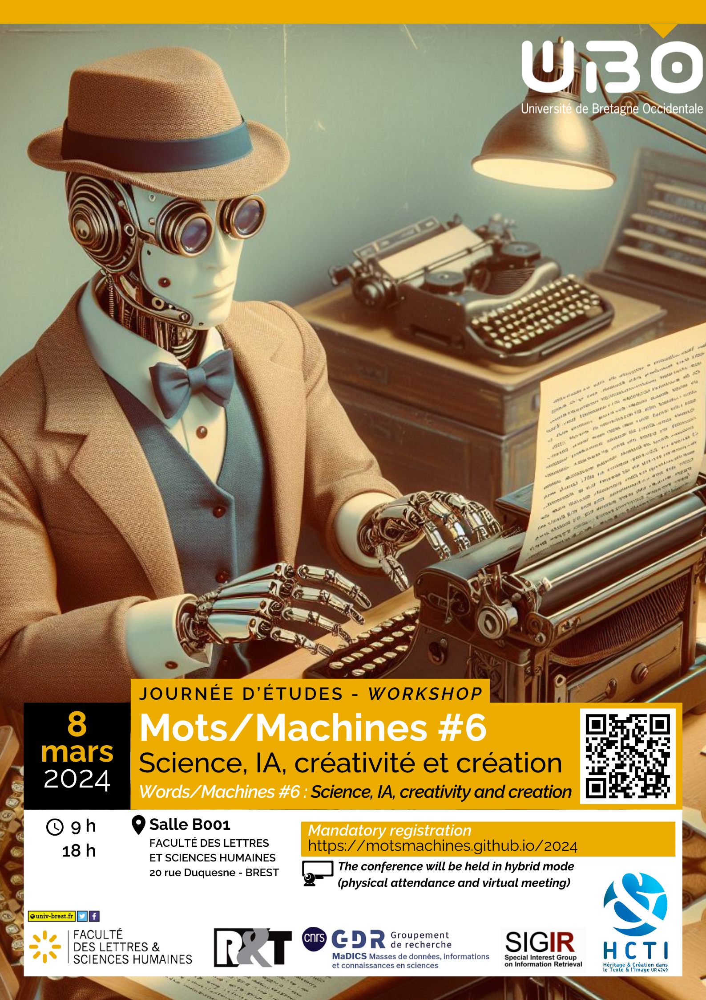

# Mots/Machines #6
 

[Accueil](https://motsmachines.github.io/2024/fr) | [Programme](program) | [Organisation](orga) | [S'inscrire](registration) | 

 

## Terminologie

**Journée d’étude : 8 mars 2024**

**Thématiques** : Intelligence artificielle, traitement automatique du langage, 
LLM, image, modèles génératifs, explicabilité, réglementation, précautions, confiance

## Lieu et accès

L'atelier se tiendra à [l'Université de Bretagne Occidentale, Faculté des Lettres et Sciences humaines](https://www.univ-brest.fr/UFR-Lettres-et-Sciences-Humaines) :

**BREST Faculté Victor Segalen**

20, rue Duquesne - CS9383729238

Salle des thèses B001

Brest Cedex 3, France

**Mots-Machines proposera également une participation EN LIGNE.**

## Contacts

[Site Web 2019](https://motsmachines.github.io/2019)

[Site Web 2020](https://motsmachines.github.io/2020)

[Site Web 2021](https://motsmachines.github.io/2021)

[Site Web 2022](https://motsmachines.github.io/2022)

[Site Web 2023](https://motsmachines.github.io/2023)

E-mail : [mots.machines@gmail.com](mailto:mots.machines@gmail.com)

## Objectifs
	
Créer un lieu de dialogue entre les informaticiens, les linguistes et les traducteurs

Promouvoir la recherche dans le milieu des étudiants

Initier des collaborations éventuelles
